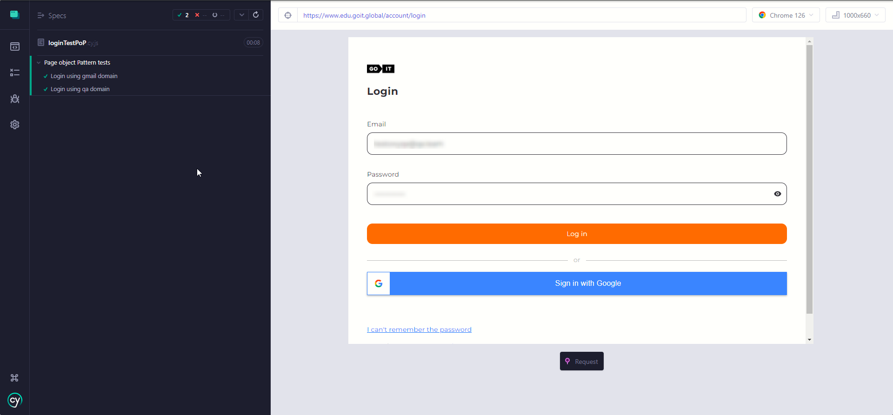

# 
GoIT HW 3  Cypress Page Object Pattern

Refractoring tests code from [Cypress Framework](https://github.com/MioLuczak/CypressFramework) repository

### 
Implementation

- All tests were refractored to use Page Object Pattern
- There's two files in Cypress [pages](./cypress/pages/) folder that corresponds to pages as follows:
  | File | Page |
  | :-: | :-: |
  | [login.js](./cypress/pages/login.js) | Login page |
  | [homePage.js](./cypress/pages/homePage.js) | Home page |

#### [login.js](./cypress/pages/login.js) file creates `Login` class that has these methods:

|         Method         | Purpose                                                                                                           |
| :--------------------: | :---------------------------------------------------------------------------------------------------------------- |
|       `navigate`       | Visits the destinated url address                                                                                 |
|  `validateLoginForm`   | Checks if the login form have:   - login and password input fields   - 'Log in' button to submit the form |
| `typeLoginCredentials` | Selects one by one every input field and type credentials passed as login and password parameters                 |
|     `loginSubmit`      | Selects the 'Log in' button and then clicks on it                                                                 |

#### [homePage.js](./cypress/pages/homePage.js) file creates `HomePage` class that has these two methods:

|   Method   |                      Purpose                      |
| :--------: | :-----------------------------------------------: |
| `openMenu` | Selects the dropdown menu button and clicks on it |
|  `logout`  | Searches for the 'Logout' button and clicks on it |

### 
Test execution

|         |          | Tests  |        |         |
| :-----: | :------: | :----: | :----: | :-----: |
| In Spec | Executed | Passed | Failed | Skipped |
|    2    |    2     |   2    |   0    |    0    |

Note:

_Due to login credentials and security, valid login credentials in [loginTestPop.cy.js](./cypress/e2e/loginTestPoP.cy.js) test were changed to invalid ones_  

Screenshot from Cypress (executed tests with passed indication):  

